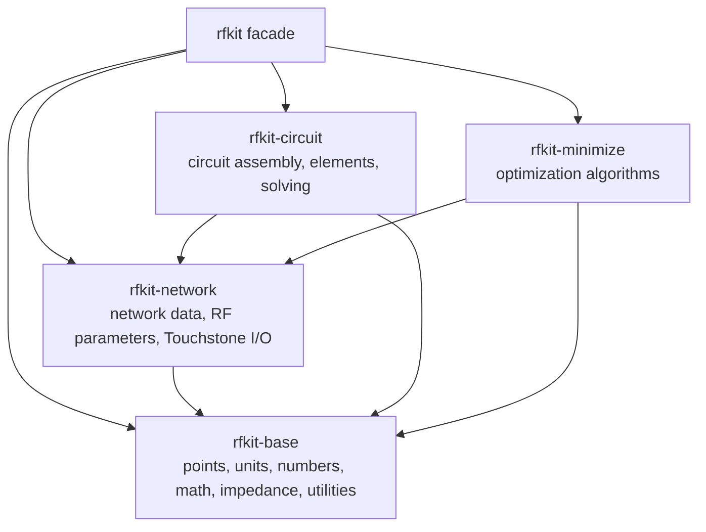

# rfkit Workspace Architecture

`rfkit` is now organized as a workspace of focused crates with a small facade crate for user-facing imports.

## Crates

- `rfkit-base` owns foundation types: `Points`, unit values, scalar traits, RF math helpers, impedance helpers, comparison utilities, and exported macros.
- `rfkit-network` owns network representations, parameter conversions, builders, and file I/O.
- `rfkit-circuit` owns element models, circuit graph assembly, and conversion from solved circuits to networks.
- `rfkit-minimize` owns optimizers such as Nelder-Mead, Powell, Brent, quasi-Newton, and CMA-ES.
- `rfkit` re-exports the public surface through `rfkit::prelude::*`, split namespaces like `rfkit::base::prelude::*`, and compatibility modules like `rfkit::pts`.

Each implementation crate also has its own `ARCHITECTURE.md` with module-level details.
