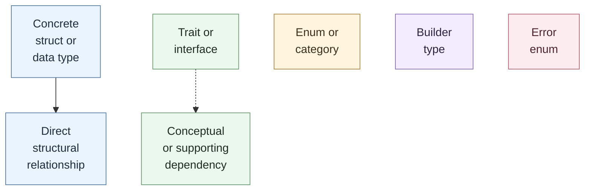
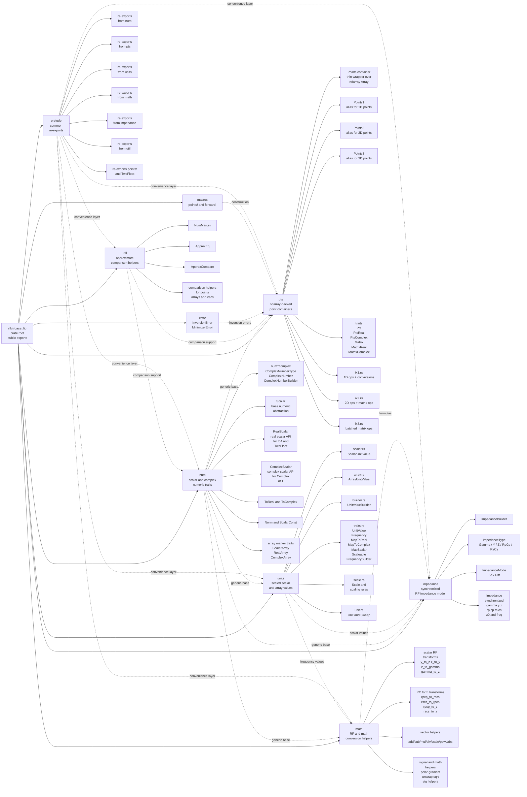
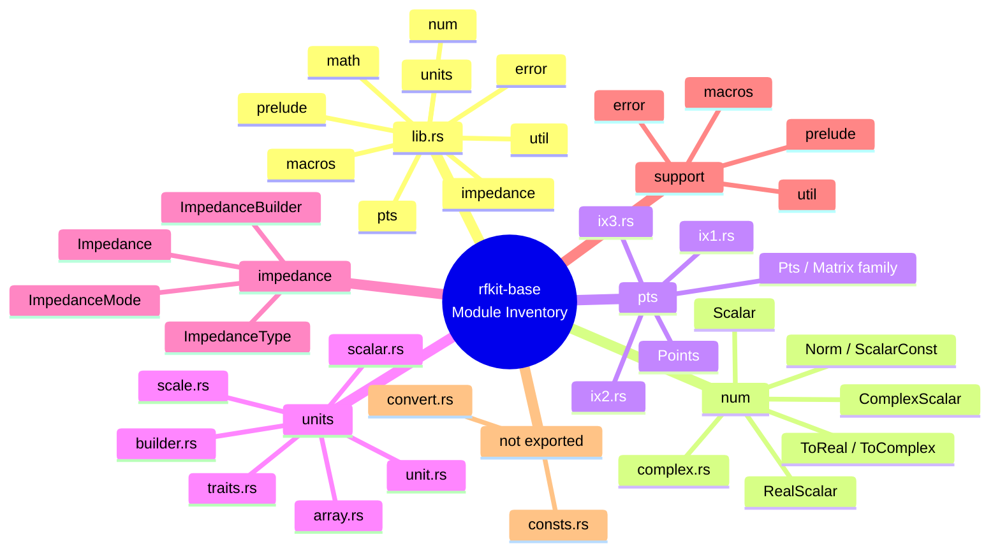

# `rfkit-base` crate architecture

This document maps the current public shape of the `rfkit-base` crate.

Notes:

- The crate root exports `macros`, `error`, `impedance`, `math`, `num`, `prelude`, `pts`, `units`, and `util`.
- `consts.rs` and `convert.rs` exist in `src/`, but they are currently not re-exported from [`lib.rs`](./src/lib.rs).

## Diagram Legend

- Solid line: direct structural relationship.
- Dashed line: conceptual or supporting dependency.
- Soft blue: concrete structs or data-carrying types.
- Soft green: traits or interfaces.
- Soft cream: enums and type categories.
- Soft lavender: builders.
- Soft rose: error enums.

## rfkit-base Module Map

## rfkit-base Core Dataflow

```mermaid
flowchart LR
    F["Frequency input
    ScalarUnitValue or
    ArrayUnitValue"] --> U1["units
    store unscaled value
    carry Scale and
    Unit metadata"]
    U1 --> M1["math
    consume UnitValue
    and Frequency
    for RF conversions"]
    M1 --> I1["impedance
    keeps related
    representations
    synchronized"]

    C1["Complex input form
    re im
    mag ang
    or dB ang"] --> CN["ComplexNumberType
    parse / convert"]
    CN --> I1

    RIN["Builder inputs
    gamma y z
    rp cp
    rs cs"] --> IB["ImpedanceBuilder"]
    IB --> I1

    I1 --> G["gamma"]
    I1 --> Y["admittance y"]
    I1 --> Z["impedance z"]
    I1 --> RP["parallel form
    rp + cp"]
    I1 --> RS["series form
    rs + cs"]
    I1 --> Z0["reference impedance z0"]
    I1 --> FF["frequency"]

    PTS["Points container
    ndarray-backed
    data"] --> ALG["point and matrix
    algebra
    shape transpose
    inverse trace det"]
    NTRAITS["num traits
    Scalar
    RealScalar
    ComplexScalar
    Norm"] --> PTS
    NTRAITS --> U1
    NTRAITS --> M1
    NTRAITS --> I1
```

## Public module inventory

## Detailed numeric, points, and units interfaces

```mermaid
classDiagram
    direction LR

    class Points {
      +Array data
      +new(array)
      +inner()
      +inner_mut()
      +swap(index1, index2)
      +zeros(shape)
      +ones(shape)
    }

    class Pts {
      <<trait>>
      +from_elem(shape, elem)
      +from_shape_fn(shape, f)
      +from_shape_vec(shape, v)
      +first()
      +last()
      +iter()
      +iter_mut()
      +slice(info)
      +slice_mut(info)
      +assign(rhs)
      +push(axis, array)
      +pt(index)
      +pt_mut(index)
      +set_pt(index, pt)
      +insert_axis(axis)
      +len()
      +npts()
      +dim()
      +shape()
      +view()
      +view_mut()
      +into_inner()
      +fill(shape, value)
      +map(f)
      +map_inplace(f)
    }

    class PtsReal {
      <<trait>>
      +from_flat_f64(data, shape)
    }

    class PtsComplex {
      <<trait>>
    }

    class Matrix {
      <<trait>>
      +nrows()
      +ncols()
      +row(index)
      +col(index)
      +set_row(index, row)
      +set_col(index, col)
      +is_square()
      +t()
      +transpose()
      +eye(size)
      +eye_value(size, value)
      +trace()
      +det()
      +inv()
      +try_inv()
    }

    class MatrixReal {
      <<trait>>
    }

    class MatrixComplex {
      <<trait>>
    }

    class Scalar {
      <<trait>>
      +from_f64(x)
      +from_usize(n)
    }

    class RealScalar {
      <<trait>>
    }

    class ComplexScalar {
      <<trait>>
      +new(re, im)
    }

    class ToReal {
      <<trait>>
      +to_real()
    }

    class ToComplex {
      <<trait>>
      +to_complex()
    }

    class Norm {
      <<trait>>
      +norm()
      +norm_sqr()
    }

    class ScalarConst {
      <<trait>>
      +EPSILON
      +INFINITY
      +MAX
      +MIN
      +MIN_POSITIVE
      +NAN
      +NEG_INFINITY
      +ZERO
      +ONE
    }

    class ApproxEq {
      <<trait>>
      +approx_eq(exemplar, precision)
      +approx_ne(exemplar, precision)
    }

    class ApproxCompare {
      <<trait>>
      +approx_gt(exemplar, precision)
      +approx_ge(exemplar, precision)
      +approx_lt(exemplar, precision)
      +approx_le(exemplar, precision)
    }

    class ComplexNumberType {
      <<enumeration>>
      ReIm
      MagAng
      Db
    }

    class ComplexNumber {
      -ComplexNumberType kind
      -real re
      -real im
      +convert(kind)
      +ri()
      +mag()
      +db()
      +ang()
    }

    class ComplexNumberBuilder {
      -kind
      -re
      -im
      +new()
      +kind(val)
      +kind_from_str(val)
      +ri(val)
      +real(val)
      +imag(val)
      +mag(val)
      +db(val)
      +angle(val)
      +build()
    }

    class Scaleable {
      <<trait>>
      +scale(scale)
      +unscale(scale)
    }

    class UnitValue {
      <<trait>>
      +new(val, scale, unit)
      +new_scaled(val, scale, unit)
      +builder()
      +npts()
      +val()
      +val_ref()
      +val_scaled()
      +scale()
      +unit()
      +set_val(val)
      +set_val_pt(val, idx)
      +set_val_scaled(val)
      +set_val_scaled_pt(val, idx)
      +set_scale(scale)
      +set_scale_str(scale)
      +set_unit(unit)
      +set_unit_str(unit)
      +zero_value()
    }

    class Frequency {
      <<trait>>
      +new_freq(val, scale)
      +new_freq_scaled(val, scale)
      +fpts()
      +freq()
      +freq_scalar(idx)
      +freq_pt(idx)
      +freq_ref()
      +freq_scaled()
      +w()
      +w_pt(idx)
      +wavelength(er)
      +set_freq(freq)
      +set_freq_pt(freq, pt)
      +set_freq_scaled(freq)
      +set_freq_scaled_pt(freq, pt)
    }

    class MapToReal {
      <<trait>>
      +real_at(val, idx)
      +real_idx(val, idx)
      +map_to_real(f)
    }

    class MapToComplex {
      <<trait>>
      +complex_at(val, idx)
      +complex_idx(val, idx)
      +map_to_complex(f)
    }

    class MapScalar {
      <<trait>>
      +map_scalar_to_real(f)
      +map_scalar_to_complex(f)
      +map_scalar_to_vec(f)
    }

    class FrequencyBuilder {
      <<trait>>
      +freq(freq)
      +freq_scaled(freq, scale)
      +start_stop_step(start, stop, step)
      +start_stop_step_scaled(start, stop, step, scale)
      +start_stop_npts(start, stop, npts, sweep)
      +start_stop_npts_scaled(start, stop, npts, scale, sweep)
    }

    class ScalarUnitValue {
      -scalar val
      -Scale scale
      -Unit unit
    }

    class ArrayUnitValue {
      -Array1 val
      -Scale scale
      -Unit unit
    }

    class UnitValueBuilder {
      -val
      -Scale scale
      -Unit unit
      +new()
      +val(val)
      +val_scaled(val, scale)
      +scale(scale)
      +scale_str(scale)
      +unit(unit)
      +unit_str(unit)
      +build()
    }

    class Scale {
      <<enumeration>>
      Atto
      Femto
      Pico
      Nano
      Micro
      Milli
      Centi
      Base
      Kilo
      Mega
      Giga
      Tera
      +to_long_string()
      +to_str()
      +multiplier()
    }

    class Sweep {
      <<enumeration>>
      Linear
      Log
    }

    class Unit {
      <<enumeration>>
      None
      Hz
      Degree
      Radian
      Lambda
      Second
      Meter
      Inch
      Farad
      Henry
      Ohm
      Sieman
      Neper
      +to_long_string()
      +to_str()
    }

    Points ..|> Pts
    PtsReal --|> Pts
    PtsComplex --|> Pts
    Matrix --|> Pts
    MatrixReal --|> Matrix
    MatrixComplex --|> Matrix

    RealScalar --|> Scalar
    ComplexScalar --|> Scalar
    RealScalar --|> ToComplex
    RealScalar --|> ApproxEq
    RealScalar --|> ApproxCompare
    ComplexScalar --|> Norm

    ComplexNumberBuilder --> ComplexNumber
    ComplexNumber --> ComplexNumberType

    ScalarUnitValue ..|> UnitValue
    ScalarUnitValue ..|> Frequency
    ScalarUnitValue ..|> ToReal
    ScalarUnitValue ..|> ToComplex
    ScalarUnitValue ..|> MapToReal
    ScalarUnitValue ..|> MapToComplex
    ScalarUnitValue ..|> MapScalar

    ArrayUnitValue ..|> UnitValue
    ArrayUnitValue ..|> Frequency
    ArrayUnitValue ..|> ToReal
    ArrayUnitValue ..|> ToComplex
    ArrayUnitValue ..|> MapToReal
    ArrayUnitValue ..|> MapToComplex
    ArrayUnitValue ..|> MapScalar

    UnitValueBuilder ..|> FrequencyBuilder
    ScalarUnitValue --> Scale
    ScalarUnitValue --> Unit
    ArrayUnitValue --> Scale
    ArrayUnitValue --> Unit
    UnitValueBuilder --> Scale
    UnitValueBuilder --> Unit
    FrequencyBuilder --> Sweep

    style Points fill:#eaf4ff,stroke:#5b7fa3,color:#1f2d3d
    style ComplexNumber fill:#eaf4ff,stroke:#5b7fa3,color:#1f2d3d
    style ScalarUnitValue fill:#eaf4ff,stroke:#5b7fa3,color:#1f2d3d
    style ArrayUnitValue fill:#eaf4ff,stroke:#5b7fa3,color:#1f2d3d

    style Pts fill:#eaf8ee,stroke:#6f9b76,color:#1f2d1f
    style PtsReal fill:#eaf8ee,stroke:#6f9b76,color:#1f2d1f
    style PtsComplex fill:#eaf8ee,stroke:#6f9b76,color:#1f2d1f
    style Matrix fill:#eaf8ee,stroke:#6f9b76,color:#1f2d1f
    style MatrixReal fill:#eaf8ee,stroke:#6f9b76,color:#1f2d1f
    style MatrixComplex fill:#eaf8ee,stroke:#6f9b76,color:#1f2d1f
    style Scalar fill:#eaf8ee,stroke:#6f9b76,color:#1f2d1f
    style RealScalar fill:#eaf8ee,stroke:#6f9b76,color:#1f2d1f
    style ComplexScalar fill:#eaf8ee,stroke:#6f9b76,color:#1f2d1f
    style ToReal fill:#eaf8ee,stroke:#6f9b76,color:#1f2d1f
    style ToComplex fill:#eaf8ee,stroke:#6f9b76,color:#1f2d1f
    style Norm fill:#eaf8ee,stroke:#6f9b76,color:#1f2d1f
    style ScalarConst fill:#eaf8ee,stroke:#6f9b76,color:#1f2d1f
    style ApproxEq fill:#eaf8ee,stroke:#6f9b76,color:#1f2d1f
    style ApproxCompare fill:#eaf8ee,stroke:#6f9b76,color:#1f2d1f
    style Scaleable fill:#eaf8ee,stroke:#6f9b76,color:#1f2d1f
    style UnitValue fill:#eaf8ee,stroke:#6f9b76,color:#1f2d1f
    style Frequency fill:#eaf8ee,stroke:#6f9b76,color:#1f2d1f
    style MapToReal fill:#eaf8ee,stroke:#6f9b76,color:#1f2d1f
    style MapToComplex fill:#eaf8ee,stroke:#6f9b76,color:#1f2d1f
    style MapScalar fill:#eaf8ee,stroke:#6f9b76,color:#1f2d1f
    style FrequencyBuilder fill:#eaf8ee,stroke:#6f9b76,color:#1f2d1f

    style ComplexNumberType fill:#fff4de,stroke:#b08a4b,color:#3b2f1a
    style Scale fill:#fff4de,stroke:#b08a4b,color:#3b2f1a
    style Sweep fill:#fff4de,stroke:#b08a4b,color:#3b2f1a
    style Unit fill:#fff4de,stroke:#b08a4b,color:#3b2f1a

    style ComplexNumberBuilder fill:#f3ecff,stroke:#8a74b8,color:#2c2340
    style UnitValueBuilder fill:#f3ecff,stroke:#8a74b8,color:#2c2340
```

## Detailed impedance, utility, and error interfaces

```mermaid
classDiagram
    direction LR

    class ComplexNumberType {
      <<enumeration>>
      ReIm
      MagAng
      Db
    }

    class ScalarUnitValue {
      -scalar val
      -Scale scale
      -Unit unit
    }

    class Scale {
      <<enumeration>>
      Atto
      Femto
      Pico
      Nano
      Micro
      Milli
      Centi
      Base
      Kilo
      Mega
      Giga
      Tera
    }

    class Unit {
      <<enumeration>>
      None
      Hz
      Degree
      Radian
      Lambda
      Second
      Meter
      Inch
      Farad
      Henry
      Ohm
      Sieman
      Neper
    }

    class Impedance {
      -ImpedanceMode mode
      -Complex y
      -Complex z
      -Complex g
      -ScalarUnitValue rp
      -ScalarUnitValue cp
      -ScalarUnitValue rs
      -ScalarUnitValue cs
      -real z0
      -ScalarUnitValue freq
      +new_from_gamma(gamma, z0, freq, mode)
      +new_from_y(y, z0, freq, mode)
      +new_from_z(z, z0, freq, mode)
      +new_from_rpcp(rp, cp, z0, freq, mode)
      +new_from_rscs(rs, cs, z0, freq, mode)
      +mode()
      +gamma()
      +y()
      +z()
      +rp()
      +cp()
      +rs()
      +cs()
      +z0()
      +freq()
      +diff_to_se()
      +se_to_diff()
      +set_gamma(g)
      +set_y(y)
      +set_z(z)
      +set_z0(z0)
      +set_rp(rp)
      +set_cp(cp)
      +set_rs(rs)
      +set_cs(cs)
      +set_freq(freq)
    }

    class ImpedanceBuilder {
      -kind
      -category
      -ImpedanceMode mode
      -ri
      -mag
      -ang
      -rp
      -cp
      -rs
      -cs
      -z0
      -freq
      +new()
      +kind(imp)
      +kind_str(imp)
      +category(cat)
      +category_str(cat)
      +mode(mode)
      +mode_str(mode)
      +ri(ri)
      +re(re)
      +im(im)
      +mag(mag)
      +db(db)
      +ang(ang)
      +r_scale(scale)
      +r_scale_str(scale)
      +c_scale(scale)
      +c_scale_str(scale)
      +rp(res)
      +rp_val(res)
      +rp_val_scaled(res)
      +cp(cap)
      +cp_val(cap)
      +cp_val_scaled(cap)
      +rs(res)
      +rs_val(res)
      +rs_val_scaled(res)
      +cs(cap)
      +cs_val(cap)
      +cs_val_scaled(cap)
      +z0(z0)
      +freq(freq)
      +freq_val(freq)
      +freq_val_scaled(freq, scale)
      +build()
    }

    class ImpedanceType {
      <<enumeration>>
      Gamma
      Y
      Z
      RpCp
      RsCs
    }

    class ImpedanceMode {
      <<enumeration>>
      Se
      Diff
    }

    class NumMargin {
      +epsilon
      +relative
      +ulps
    }

    class ApproxEq {
      <<trait>>
      +approx_eq(exemplar, precision)
      +approx_ne(exemplar, precision)
      +assert_approx_eq(exemplar, precision, test, idx)
      +assert_approx_ne(exemplar, precision, test, idx)
    }

    class ApproxCompare {
      <<trait>>
      +approx_gt(exemplar, precision)
      +approx_ge(exemplar, precision)
      +approx_lt(exemplar, precision)
      +approx_le(exemplar, precision)
      +assert_approx_gt(exemplar, precision, test, idx)
      +assert_approx_ge(exemplar, precision, test, idx)
    }

    class InversionError {
      <<enumeration>>
      NotSquare
      Singular
      DimensionMismatch
    }

    class MinimizerError {
      <<enumeration>>
      ConstraintViolation
      FileError
      FunctionEvaluationError
      GradientEvaluationError
      HessianEvaluationError
      InfeasibleStartingPoint
      InvalidBracket
      InvalidDimension
      InvalidDirectionSet
      InvalidInitialPoints
      InvalidInitialSimplex
      InvalidParameters
      InvalidStepSize
      InvalidTolerance
      LinearAlgebraError
      LinearSearchFailed
      LinearSystemSingular
      LineSearchFailed
      MaxIterationsExceeded
      NumericalError
      NoMinimumFound
      NumericalInstability
      NumericalOverflow
      SameSignError
      SingularHessianApproximation
      ZeroDerivative
      ZeroGradient
    }

    ImpedanceBuilder --> Impedance
    ImpedanceBuilder --> ImpedanceType
    ImpedanceBuilder --> ImpedanceMode
    ImpedanceBuilder --> ComplexNumberType
    ImpedanceBuilder --> ScalarUnitValue

    Impedance --> ScalarUnitValue
    Impedance --> ImpedanceMode
    ScalarUnitValue --> Scale
    ScalarUnitValue --> Unit

    ApproxCompare --|> ApproxEq
    NumMargin --> ApproxEq

    style ScalarUnitValue fill:#eaf4ff,stroke:#5b7fa3,color:#1f2d3d
    style NumMargin fill:#eaf4ff,stroke:#5b7fa3,color:#1f2d3d
    style Impedance fill:#eaf4ff,stroke:#5b7fa3,color:#1f2d3d

    style ApproxEq fill:#eaf8ee,stroke:#6f9b76,color:#1f2d1f
    style ApproxCompare fill:#eaf8ee,stroke:#6f9b76,color:#1f2d1f

    style ComplexNumberType fill:#fff4de,stroke:#b08a4b,color:#3b2f1a
    style Scale fill:#fff4de,stroke:#b08a4b,color:#3b2f1a
    style Unit fill:#fff4de,stroke:#b08a4b,color:#3b2f1a
    style ImpedanceType fill:#fff4de,stroke:#b08a4b,color:#3b2f1a
    style ImpedanceMode fill:#fff4de,stroke:#b08a4b,color:#3b2f1a

    style ImpedanceBuilder fill:#f3ecff,stroke:#8a74b8,color:#2c2340

    style InversionError fill:#fdecef,stroke:#b46a7a,color:#4a2230
    style MinimizerError fill:#fdecef,stroke:#b46a7a,color:#4a2230
```

