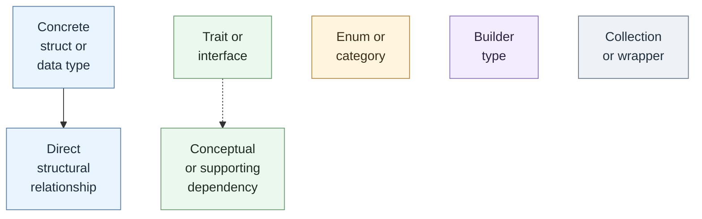
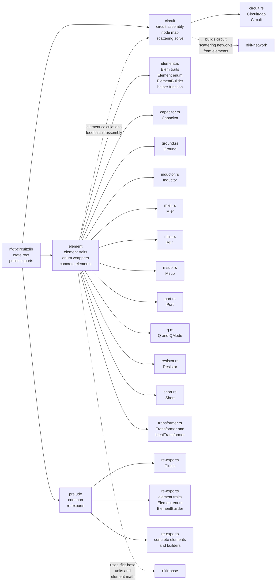
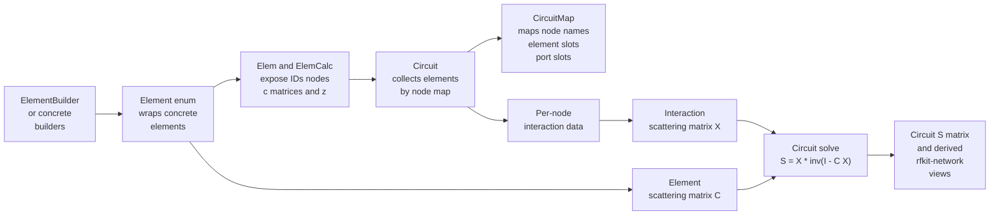
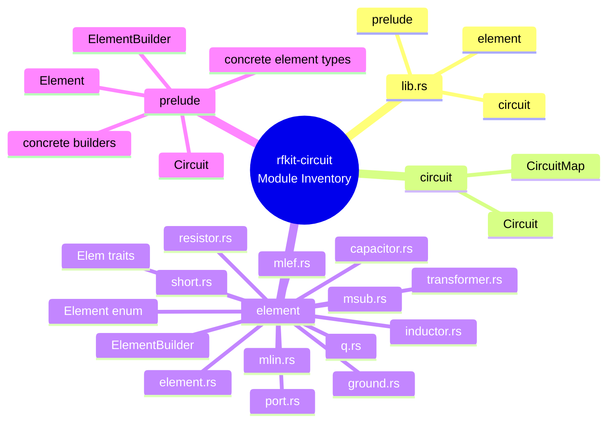
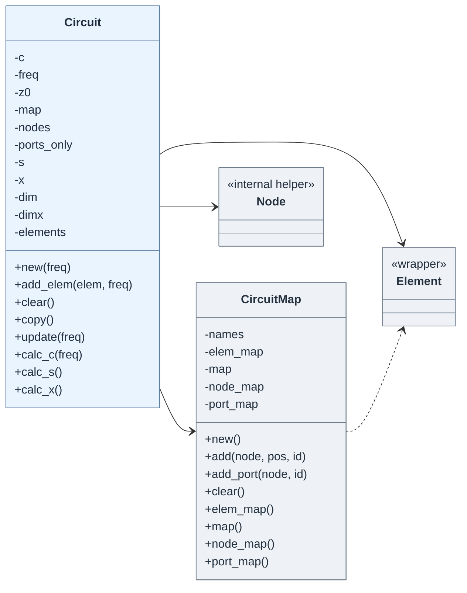

# `rfkit-circuit` crate architecture

This document maps the current public shape of the `rfkit-circuit` crate.

Notes:

- The crate root exports `circuit`, `element`, and `prelude`.
- The crate builds on `rfkit-base` for units, points, and impedance helpers, and on `rfkit-network` for network representations.
- `mbend.rs` exists, but the `mbend` module is currently commented out of [`element.rs`](./src/element.rs).

## Diagram Legend

## rfkit-circuit Module Map

## rfkit-circuit Core Dataflow

## Public Module Inventory

## Detailed Element Interfaces

```mermaid
classDiagram
    direction LR

    class ElemType {
      <<enumeration>>
      Capacitor
      Ground
      IdealTransformer
      Inductor
      Mbend
      Mlef
      Mlin
      Msub
      None
      Port
      Resistor
      Short
      Transformer
      +to_str()
    }

    class Elem {
      <<trait>>
      +id()
      +elem()
      +nodes()
    }

    class ElemCalc {
      <<trait>>
      +c(freq)
      +c_at(freq, idx)
      +c_at_freq(freq, idx)
      +net(freq)
      +z_scalar(freq)
      +z(freq)
      +z_at(freq, idx)
    }

    class Lumped {
      <<trait>>
      +val()
      +val_scaled()
      +scale()
      +unit()
      +set_val(val)
      +set_val_scaled(val)
      +set_scale(scale)
    }

    class Distributed {
      <<trait>>
      +width()
      +val()
      +set_width_val(val)
      +set_width_unit(unit)
      +set_length_val(val)
      +set_length_unit(unit)
    }

    class DistributedCalc {
      <<trait>>
      +length(freq)
      +gamma(freq)
      +er(freq)
    }

    class Term {
      <<trait>>
      +val()
      +set_val(val)
    }

    class Element {
      <<enumeration wrapper>>
      Capacitor
      Ground
      IdealTransformer
      Inductor
      Mlef
      Mlin
      Port
      Resistor
      Short
      Transformer
      +val()
    }

    class ElementBuilder {
      -id
      -unitval
      -val
      -n
      -km
      -m
      -l1
      -l2
      -q
      -q1
      -q2
      -width
      -length
      -gamma
      +build()
    }

    class QMode {
      <<enumeration>>
      None
      Series
      Parallel
    }

    class Q
    class QBuilder
    class Capacitor
    class CapacitorBuilder
    class Inductor
    class InductorBuilder
    class Resistor
    class ResistorBuilder
    class Port
    class PortBuilder
    class Ground
    class Short
    class Msub
    class MsubBuilder
    class Mlin
    class MlinBuilder
    class Mlef
    class MlefBuilder
    class Transformer
    class TransformerBuilder
    class IdealTransformer
    class IdealTransformerBuilder

    ElemCalc --|> Elem
    Lumped --|> Elem
    Distributed --|> Elem
    DistributedCalc --|> Elem
    Term --|> Elem

    Element ..|> Elem
    Element ..|> ElemCalc
    Element --> ElemType
    ElementBuilder --> Element

    Q --> QMode
    QBuilder --> Q
    Capacitor --> Q
    Inductor --> Q
    Transformer --> Q

    CapacitorBuilder --> Capacitor
    InductorBuilder --> Inductor
    ResistorBuilder --> Resistor
    PortBuilder --> Port
    MsubBuilder --> Msub
    MlinBuilder --> Mlin
    MlefBuilder --> Mlef
    TransformerBuilder --> Transformer
    IdealTransformerBuilder --> IdealTransformer

    style ElemType fill:#fff4de,stroke:#b08a4b,color:#3b2f1a
    style QMode fill:#fff4de,stroke:#b08a4b,color:#3b2f1a

    style Elem fill:#eaf8ee,stroke:#6f9b76,color:#1f2d1f
    style ElemCalc fill:#eaf8ee,stroke:#6f9b76,color:#1f2d1f
    style Lumped fill:#eaf8ee,stroke:#6f9b76,color:#1f2d1f
    style Distributed fill:#eaf8ee,stroke:#6f9b76,color:#1f2d1f
    style DistributedCalc fill:#eaf8ee,stroke:#6f9b76,color:#1f2d1f
    style Term fill:#eaf8ee,stroke:#6f9b76,color:#1f2d1f

    style Element fill:#eef2f7,stroke:#6c7a89,color:#23303d

    style ElementBuilder fill:#f3ecff,stroke:#8a74b8,color:#2c2340
    style QBuilder fill:#f3ecff,stroke:#8a74b8,color:#2c2340
    style CapacitorBuilder fill:#f3ecff,stroke:#8a74b8,color:#2c2340
    style InductorBuilder fill:#f3ecff,stroke:#8a74b8,color:#2c2340
    style ResistorBuilder fill:#f3ecff,stroke:#8a74b8,color:#2c2340
    style PortBuilder fill:#f3ecff,stroke:#8a74b8,color:#2c2340
    style MsubBuilder fill:#f3ecff,stroke:#8a74b8,color:#2c2340
    style MlinBuilder fill:#f3ecff,stroke:#8a74b8,color:#2c2340
    style MlefBuilder fill:#f3ecff,stroke:#8a74b8,color:#2c2340
    style TransformerBuilder fill:#f3ecff,stroke:#8a74b8,color:#2c2340
    style IdealTransformerBuilder fill:#f3ecff,stroke:#8a74b8,color:#2c2340

    style Q fill:#eaf4ff,stroke:#5b7fa3,color:#1f2d3d
    style Capacitor fill:#eaf4ff,stroke:#5b7fa3,color:#1f2d3d
    style Inductor fill:#eaf4ff,stroke:#5b7fa3,color:#1f2d3d
    style Resistor fill:#eaf4ff,stroke:#5b7fa3,color:#1f2d3d
    style Port fill:#eaf4ff,stroke:#5b7fa3,color:#1f2d3d
    style Ground fill:#eaf4ff,stroke:#5b7fa3,color:#1f2d3d
    style Short fill:#eaf4ff,stroke:#5b7fa3,color:#1f2d3d
    style Msub fill:#eaf4ff,stroke:#5b7fa3,color:#1f2d3d
    style Mlin fill:#eaf4ff,stroke:#5b7fa3,color:#1f2d3d
    style Mlef fill:#eaf4ff,stroke:#5b7fa3,color:#1f2d3d
    style Transformer fill:#eaf4ff,stroke:#5b7fa3,color:#1f2d3d
    style IdealTransformer fill:#eaf4ff,stroke:#5b7fa3,color:#1f2d3d
```

## Detailed Circuit Interfaces

