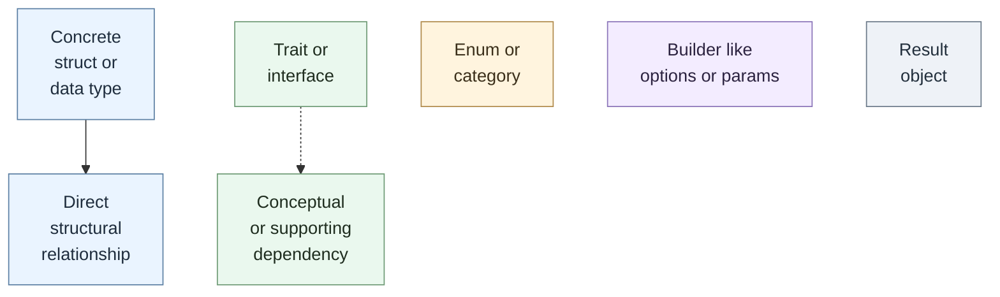
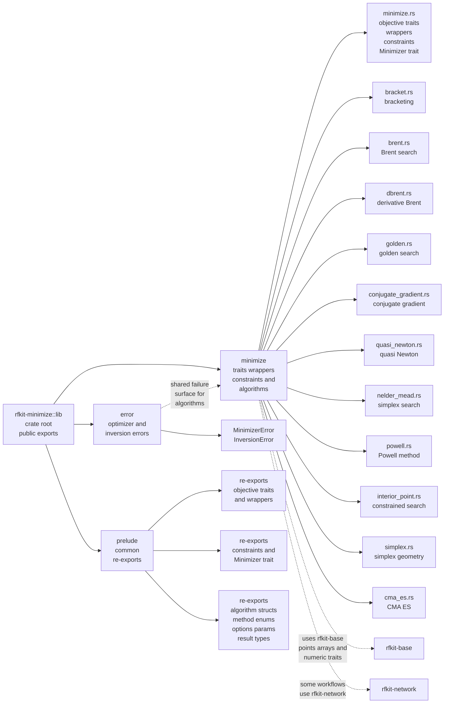
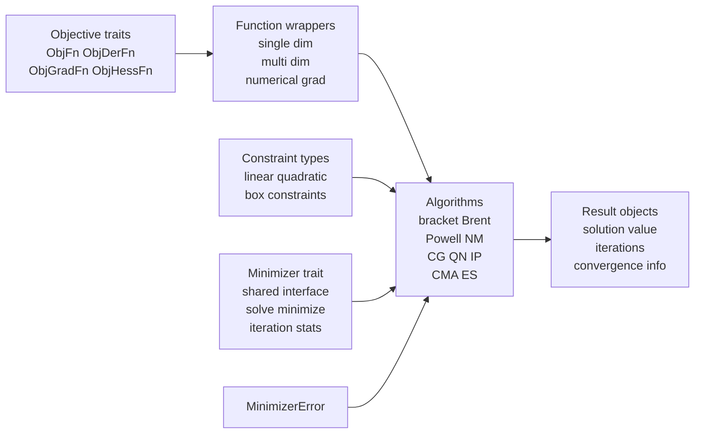
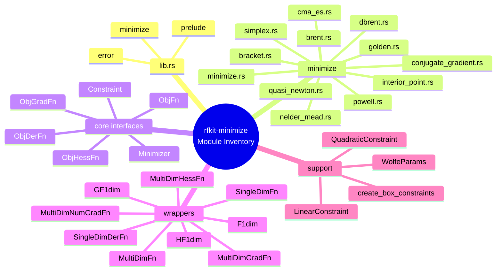
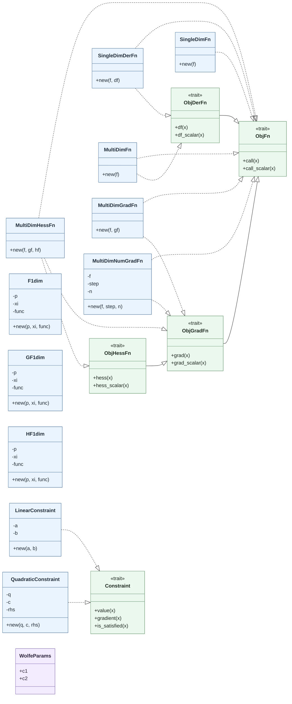

# `rfkit-minimize` crate architecture

This document maps the current public shape of the `rfkit-minimize` crate.

Notes:

- The crate root exports `error`, `minimize`, and `prelude`.
- The crate builds on `rfkit-base` point and numeric abstractions, and also uses `rfkit-network` in some optimization workflows.

## Diagram Legend

## rfkit-minimize Module Map

## rfkit-minimize Core Dataflow

## Public Module Inventory

## Detailed Objective And Constraint Interfaces

## Detailed Algorithm Interfaces

```mermaid
classDiagram
    direction LR

    class Minimizer {
      <<trait>>
      +minimize()
      +x()
      +fx()
      +iterations()
      +converged()
    }

    class Bracket
    class BracketOptions
    class BracketResult
    class Brent
    class BrentResult
    class Golden
    class GoldenResult
    class DBrent
    class DBrentMethod {
      <<enumeration>>
      Bisection
      Newton
      Secant
    }
    class DBrentResult
    class NelderMead
    class NelderMeadMethod {
      <<enumeration>>
    }
    class NelderMeadOptions
    class NelderMeadResult
    class Powell
    class PowellResult
    class ConjGrad
    class ConjGradMethod {
      <<enumeration>>
      FletcherReeves
      PolakRibiere
      HestenesStiefel
    }
    class ConjGradResult
    class QuasiNewton
    class QuasiNewtonMethod {
      <<enumeration>>
      BFGS
      DFP
    }
    class QuasiNewtonResult
    class InteriorPoint
    class InteriorPointMethod {
      <<enumeration>>
      Barrier
      PrimalDual
    }
    class InteriorPointParams
    class InteriorPointResult
    class Simplex
    class SimplexResult
    class CmaEs
    class CmaEsResult
    class MinimizerError {
      <<enumeration>>
      ConstraintViolation
      InvalidParameters
      MaxIterationsExceeded
      NumericalError
      LineSearchFailed
      NoMinimumFound
      and others
    }

    Bracket ..|> Minimizer
    Brent ..|> Minimizer
    Golden ..|> Minimizer
    DBrent ..|> Minimizer
    NelderMead ..|> Minimizer
    Powell ..|> Minimizer
    ConjGrad ..|> Minimizer
    QuasiNewton ..|> Minimizer
    InteriorPoint ..|> Minimizer
    CmaEs ..|> Minimizer

    Bracket --> BracketOptions
    Bracket --> BracketResult
    Brent --> BrentResult
    Golden --> GoldenResult
    DBrent --> DBrentMethod
    DBrent --> DBrentResult
    NelderMead --> NelderMeadMethod
    NelderMead --> NelderMeadOptions
    NelderMead --> NelderMeadResult
    Powell --> PowellResult
    ConjGrad --> ConjGradMethod
    ConjGrad --> ConjGradResult
    QuasiNewton --> QuasiNewtonMethod
    QuasiNewton --> QuasiNewtonResult
    InteriorPoint --> InteriorPointMethod
    InteriorPoint --> InteriorPointParams
    InteriorPoint --> InteriorPointResult
    Simplex --> SimplexResult
    CmaEs --> CmaEsResult
    MinimizerError ..> Minimizer

    style Minimizer fill:#eaf8ee,stroke:#6f9b76,color:#1f2d1f
    style DBrentMethod fill:#fff4de,stroke:#b08a4b,color:#3b2f1a
    style NelderMeadMethod fill:#fff4de,stroke:#b08a4b,color:#3b2f1a
    style ConjGradMethod fill:#fff4de,stroke:#b08a4b,color:#3b2f1a
    style QuasiNewtonMethod fill:#fff4de,stroke:#b08a4b,color:#3b2f1a
    style InteriorPointMethod fill:#fff4de,stroke:#b08a4b,color:#3b2f1a
    style MinimizerError fill:#fdecef,stroke:#b46a7a,color:#4a2230

    style Bracket fill:#eaf4ff,stroke:#5b7fa3,color:#1f2d3d
    style Brent fill:#eaf4ff,stroke:#5b7fa3,color:#1f2d3d
    style Golden fill:#eaf4ff,stroke:#5b7fa3,color:#1f2d3d
    style DBrent fill:#eaf4ff,stroke:#5b7fa3,color:#1f2d3d
    style NelderMead fill:#eaf4ff,stroke:#5b7fa3,color:#1f2d3d
    style Powell fill:#eaf4ff,stroke:#5b7fa3,color:#1f2d3d
    style ConjGrad fill:#eaf4ff,stroke:#5b7fa3,color:#1f2d3d
    style QuasiNewton fill:#eaf4ff,stroke:#5b7fa3,color:#1f2d3d
    style InteriorPoint fill:#eaf4ff,stroke:#5b7fa3,color:#1f2d3d
    style Simplex fill:#eaf4ff,stroke:#5b7fa3,color:#1f2d3d
    style CmaEs fill:#eaf4ff,stroke:#5b7fa3,color:#1f2d3d

    style BracketOptions fill:#f3ecff,stroke:#8a74b8,color:#2c2340
    style NelderMeadOptions fill:#f3ecff,stroke:#8a74b8,color:#2c2340
    style InteriorPointParams fill:#f3ecff,stroke:#8a74b8,color:#2c2340

    style BracketResult fill:#eef2f7,stroke:#6c7a89,color:#23303d
    style BrentResult fill:#eef2f7,stroke:#6c7a89,color:#23303d
    style GoldenResult fill:#eef2f7,stroke:#6c7a89,color:#23303d
    style DBrentResult fill:#eef2f7,stroke:#6c7a89,color:#23303d
    style NelderMeadResult fill:#eef2f7,stroke:#6c7a89,color:#23303d
    style PowellResult fill:#eef2f7,stroke:#6c7a89,color:#23303d
    style ConjGradResult fill:#eef2f7,stroke:#6c7a89,color:#23303d
    style QuasiNewtonResult fill:#eef2f7,stroke:#6c7a89,color:#23303d
    style InteriorPointResult fill:#eef2f7,stroke:#6c7a89,color:#23303d
    style SimplexResult fill:#eef2f7,stroke:#6c7a89,color:#23303d
    style CmaEsResult fill:#eef2f7,stroke:#6c7a89,color:#23303d
```

