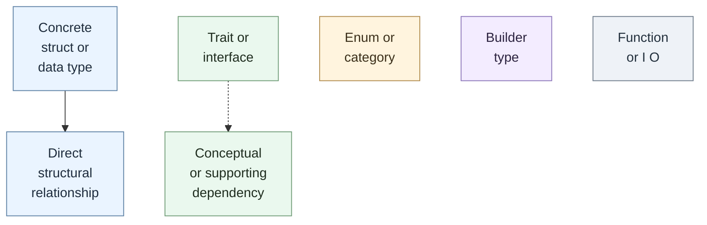
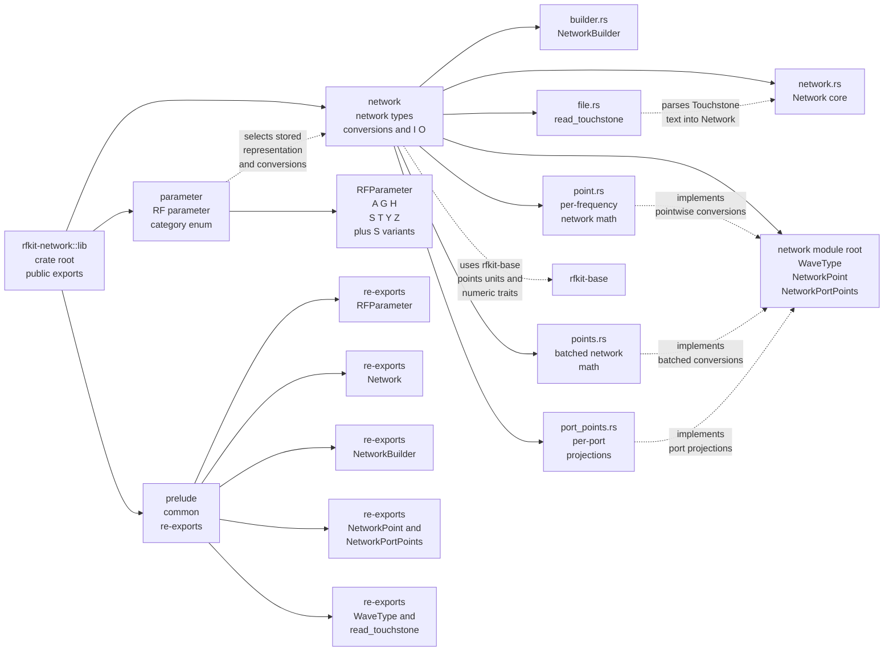
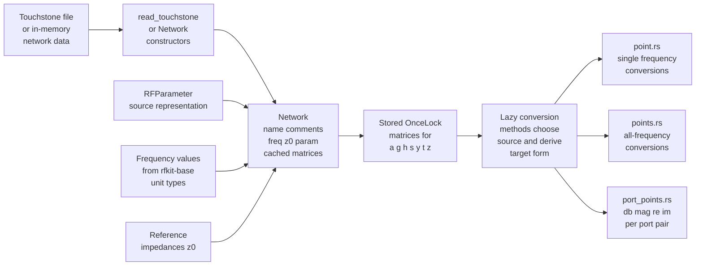
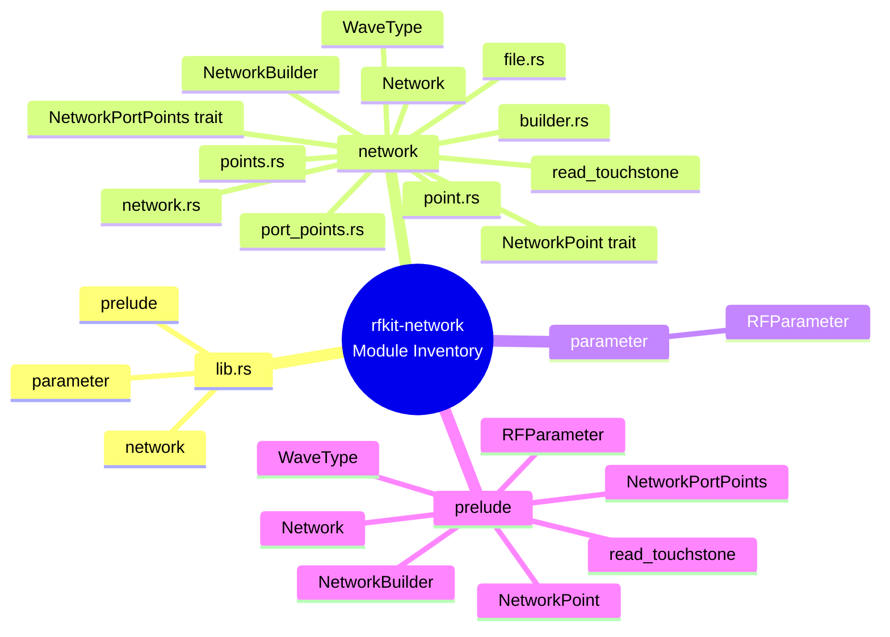
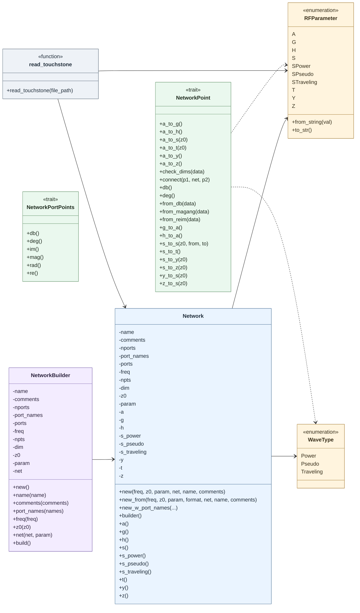

# `rfkit-network` crate architecture

This document maps the current public shape of the `rfkit-network` crate.

Notes:

- The crate root exports `network`, `parameter`, and `prelude`.
- The crate builds on `rfkit-base` for numeric traits, point containers, units, and comparison helpers.

## Diagram Legend

- Solid line: direct structural relationship.
- Dashed line: conceptual or supporting dependency.
- Soft blue: concrete structs or data-carrying types.
- Soft green: traits or interfaces.
- Soft cream: enums and type categories.
- Soft lavender: builders.
- Soft gray-blue: functions or I/O helpers.

## rfkit-network Module Map

## rfkit-network Core Dataflow

## Public Module Inventory

## Detailed Network Types And Interfaces

